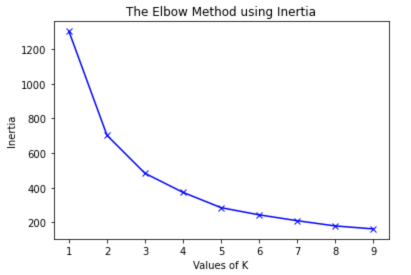
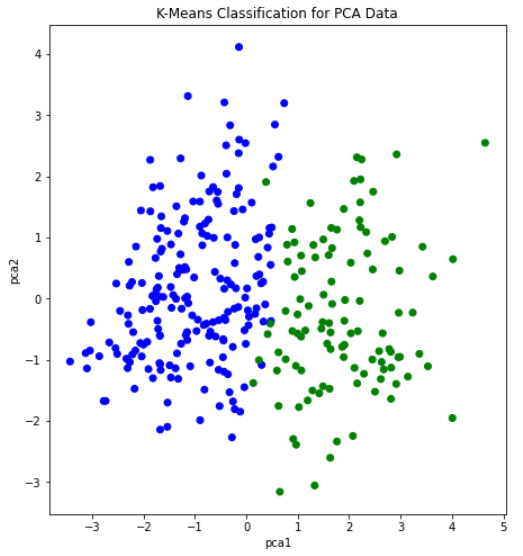

## Project Proposal
### Infographic

  

### Motivation & Background
Today, heart disease is the leading cause of death around the globe. In the United States alone, heart disease claims the life of one person every 36 seconds. Annually, it is responsible for the deaths of roughly 655,000 Americans which equates to 1 in every 4 deaths. To make matters worse, it costs our country about $219 billion per year due to healthcare service costs, medical costs, and lost productivity costs. Our group understands the impact this disease can have on so many individuals. Because of this, we decided to carry out our machine learning project on the prediction of heart disease.
#### Our Data Set
The data set we are using is a combination of data from four different health clinics around the globe, Cleveland Clinic Foundation, Hungarian Institute of Cardiology, V.A. Medical Center in Long Beach, CA, and University Hospital in Zurich, Switzerland. Each sample in the data set represents a person that was tested as a part of a heart disease study conducted by these facilities. The data set includes a discrete binary predictor of the current likelihood the patient has of having heart disease as well. We believe this predictor is based on how much specific blood vessels around each patient’s heart have narrowed.

#### Data Cleaning
Ultimately, we have four datasets to work with: the pre-processed dataset from Kaggle with 14 features and 3 original, unprocessed data-sets with 75 features. Throughout this project, we will mostly be using the Kaggle dataset to run our unsupervised and supervised algorithms. However, the Kaggle data set did not give us much information detailing how the data was cleaned and processed. So, in order to explore the data sets and make the three original data-sets useable, we decided to process the original data ourselves.

While there were originally 75 features, many of them were labelled by the uploader as "unusable" or simply had all, or mostly, null values. Null values were represented by "-9" in the data set. We used pandas to replace the -9 values with Nan for each of the datasets. We then removed individual data-points if they had more than 2/3 of their features as null, since we were unlikely to gain much information from such a data point. For points with far fewer null values, we tried estimating their values. For discrete values, we found the mode for that feature to use as a replacement value. For continuous values, we used the mean. Additionally, our dataset had many non-binary categorical features. Because all of the unsupervised clustering algorithms that we will be running for this project are distance-based, we used scikitlearn to One-Hot-Encode those features, as we didn't want more weight given to the higher categorical values.

#### Data Exploration and Scaling
With all of the data having been cleaned, we were ready to begin exploring the dataset. We began by looking at the number of datapoints with a target value of 0 versus 1, no heart disease versus heart disease. The results of this are plotted below, with slightly more patients having a target value of 1. We then created a correlation heat-map using Python's seaborn library. This visual would give us a good starting point in exploring the data, as it would tell us which features seem strongly correlated with heart disease. The values closest to 1 and -1 indicate strong positve and negative correlation respectively. Indicating a relationship between two variables. The last row or last column is our ground truth so variables with a strong relationship in that row should have a strong ability to predict heart disease.

  
   

Initially, there did not appear to be any extremely strong correlation of any particular feature with heart-disease. Out of all the continuous features, "thalach," which represents the maximum heart-rate achieved by the patient, seemed to be most strongly correlated with heart disease. Looking at the histogram below, we can see that plotting this feature gives a roughly normal distribution. However, it does appear to be skewed left. In order to help visualize the correlation, we also created a scatter plot, and separated the data points by the target value. Clearly, the higher the maximum heart rate achieved, the more likely the target value is to be 1 (heart-disease present).

  
   
  

We then created histograms and box plots for all continous features in the Kaggle pre-processed data-set, which are shown below. Most of the continuous features appear to be approximately normally distributed, which lead us to believe we should scale the data using sklearn's StandardScaler.

  
   
  
  

  
  
  

As for the discrete features, we decided to mainly use bar graphs to visualize the data. For the most important discrete features (features with most positive and most negative correlation relative to the target value), we created both an overall bar graph of all occurances and a bar graph separated by the target value (where 0 represents absence of heart disease and 1 represents presence of heart disease). These figures are displayed below.

  
  

  
  
  

  
  

  
  
  

### Methods
For the unsupervised portion of our project, we will use the k-means and DBSCAN algorithm to cluster our patients together under whether they have or do not have heart disease. We want to find the most important attributes that indicate the presence of heart disease for the patients in our data. Additionally, we will run PCA on the Kaggle dataset to see if it is possible to reduce the dimentionality of our dataset. For the supervised portion of our project, we plan to use a variety of machine learning techniques. In previous studies, the methods that have shown the most promise have been support vector machines (SVM), neural networks, decision trees, and logistic regression. We will be using classification for both of these. The UCI dataset we have been provided with has a goal attribute, which is a binary number of zero (< 50% narrowing of major vessels) to 1 (> 50% narrowing of major vessels). The goal for this model is to find trends within our data, and we hope these trends will allow us to find the groups most at risk of developing heart disease. For some of the supervised algorithms, we chose to use the Hungary data set in addition to the Kaggle dataset. However the target values were coded differently, which posed a problem. This is discussed more in-depth in the SVM portion of our project further down the page.

### Discussion

#### PCA
Getting into the unsupervised portion of this project, we decided to first run PCA on the scaled data-set to see if we would be able to reduce the dimentionality in any way. Our datasets have a high dimensionality and reducing this will allow us to increase the accuracy and recall of our models. However, after running PCA, it became apparent that it was unlikely that we could reduce our dimensionality by much. While the first principal component did contain a much larger percentage of the overall variance than any other component, the variance was not concentrated there - it contained only about 20% of the overall variance, shown in the graph below. At best, we would be able to reduce the dimentionality from 14 to 10 and would still only retain about 90% of the variance.

  

We still attempted plotting the first principal component against the second, and found what appeared to be a soft split of the target values, with values of 1 mostly on the left portion of the graph, and values of 0 mostly on the right portion of the graph. This lead us to believe that a form of soft SVM might yield good results in the supervised portion of this project. This visual also showed that our dataset would likely be able to form accurate clusters when running K-means. Overall, however, we did not gain too much insight from our data-set by running PCA. With that, we moved on the K-Means clustering.

  

#### K-Means Clustering
Next, we decided to run the K-means algorithm to try clustering the data. We conducted K-means on both the original dataset, and the dataset after going through PCA. The most important aspect of running this algorithm was to determine if our data contained clusters useful in classifying attributes or groups of attributes to specific outputs. The elbow method was used to determine the number of clusters for the K-means algorithm, which estimates the improvement for the addition of each cluster. Below are the graphs for the elbow method.

  
  

After creating the plot with the original dataset, there did not appear to be any clearly discernable elbow. It was plausible, however, that the elbow was in the range of 2 to 4 clusters. Therefore, we ran K-Means with 2, 3, and 4 clusters, and compared the results. The visualization scatter plots for 2 clusters, 4 clusters, and the PCA data are all shown below. The elbow in the PCA transformed dataset was clearer than the elbow found with the original dataset. Therefore, we decided to run k-means with only 2 cluster for the PCA transformed data set. Note that the values we used in K-means were scaled using StandardScaler, which is why the x-axis ranges from -3 to 3 for the "age" feature.

  
  
  
  

From the graph we see a semblance of a divide, but the differences between the clusters still isn't as clear as we would like it to be, however we think that this K-means classification can strengthen our supervised learning algorithms later down the line if we use the K-means classifiers as a feature.

  

Looking at the stats we see that each n-clusters performed relatively well. However, no clustering was dominant in all 3 metrics. Which we found surprising because we believed that as the number of clusters increases, we would see the model overgeneralize the dataset a bit more. Although 4 clusters performed the worst in 2/3 metrics, it showed us that increasing the clusters further could be detrimental to our models. Overall, the 2, 3, and PCA clusters performed the best. All being comparable in all 3 metrics with differences of about .01. The only exception to this being 3 clusters’s recall at about .95. We also decided to calculate the BetaCV measure for K-Means with 2 clusters. BetaCV is a measure of the intracluster to intercluster distance multiplied by the ratio of edges of of a cluster to edges into a cluser. A smaller betaCV indicates a better K-Means result. Ultimately, this value was calculated to be 1.644, which is relatively good considering the high dimentionality of our dataset (keep in mind how the curse of dimensionality can affect the Euclidian distances).

#### DBSCAN
We also ran DBSCAN to see if we could achieve results comparable to K-Means, or better. DBSCAN is a density based clustering algorithm, and so it can detect abnormally shaped clusters. The purity in all of our runs for K-Means were around 0.80; which we thought might be partially due to non-circular (hyperspherical) clusters. The first step in performing this algorithm was to tune the parameters. First, we chose the min_samples parameter by simply doubling the number of total features, leaving us with a value of 28 for min_samples. Next, to find the value of epsilon, we used a form of K-Nearest-Neighbors with the Elbow Method, shown in the plot below.

  

Here, we use the Elbow Method to approximate a good value for espilon in DBSCAN. We find the distance of the closest neighbor to each point and order them from least to greatest. The center of the line graph represents the majority of the distances each point have to their neighbors. Using the area where the slope drastically increases on the right-hand side of the graph, or the elbow, will allow us to capture a good epsilon value that can ignore outliers. In this case, 4 is a good value for epsilon. After running DBSCAN with multiple values of epsilon around this range, we found the best results occured when epsilon was 4.26.  Once again, we graphed age vs thalach and separated by the target value, found below.. You can compare the results achieved by DBSCAN (left) to the ground-truth (right). 

  
  

DBSCAN achieved an overall purity of 0.7558, precision of 0.847, and recall of 0.6727. The purity of the clusters formed was relatively average compared to K-means in this scenario. However, a precision of 0.847 was the highest we have achieved with our unsupervised learning algorithms. This means there were very few false positives. While this is significant, recall is more important for us, as an incorrect prediction could prove to be deadly. Unforunately, the recall with DBSCAN was the worst out of all the unsupervised algorithms performed. This could possibly be due to different densities within an apparent cluster. Under these conditions, DBSCAN did not perform well. Thus, K-means seems to be the better unsupervised clustering algorithm to use when predicting heart disease.

### Supervised Learning

With many unsupervised algorithms under our belt, we decided to begin the supervised portion of this project. This is where we expected the most promising results, as many of the research papers we read during the project proposal stage used supervised learning strategies. For this section of the project, our plan was to try a number of different algorithms. In particular, we planned on using SVM, Logistic Regression, Neural Networks, and Decision Trees/Random Forests. For consistency, we chose to run these algorithms on the Kaggle dataset that we used in the unsupervised learning portion of the project. 
We also ran each supervised learning algorithm detailed above on the Hungary data set, one of the UCI data sets referenced by the authors of the Kaggle data set. However, with our unfortunate lack of knowledge on how the kaggle authors pruned their data set and chose their specific features, the Hungary data set retains more of its features when we implement the supervised learning algorithms on it. Thus, there is a higher chance for lower precision and recall, due to the amount of potentially useless features considered and higher number of null values during each algorithm.
Each data set utilized in the supervised learning portion of this project had its feature values scaled using the sklearn StandardScaler. The Kaggle data set was also One-Hot Encoded on features that required it, with the Hungary data set not receiving this treatment due to the uncertainty of which features required it.

#### SVM

SVM or support vector machines was the algorithm we expected to show the best results, as similar projects discussed in research papers had the best results with it. Similarly, our PCA results from the unsupervised portion of the project led us to believe SVM would provide us with good and accurate results. We started by splitting our dataset into a testing and training set. For this supervised method, we decided to do a 50-50 split. That is, 50% of the data went into the training dataset and the other 50% went into the testing set. After we split the data, we were ready to run SVM.

We started by running SVM by just using the default parameters, which surprisingly gave us good results. On average, we achieved an accuracy of roughly 70%-80%. In order to find the optimal parameters for SVM, we employed GridSearchCV by using nested for-loops with each relevant parameter to tune. We ran GridSearchCV a couple of times and got varying results. In other words, there was not one definitive collection of settings that always appeared to produce the best results. One example of optimal settings are as follows: a sigmoid kernel with a C value of 1, degree of 3, coefficient of 1.001, and a gamma value set to “auto”. For reference, the C value is the regularization parameter, the degree is the degree of the polynomial kernel function (if applicable but not in this case due to the type of kernel used), gamma is the kernel coefficient for “rbf” (not applicable with these settings), and the coefficient is the independent term in the kernel function. Once we tuned the parameters, our accuracy increased from roughly 70%-80% to 80%-90%. As an example, refer to the graphs below. The graph on the left represents the ground truth values, while the graph on the right represents a single run of SVM that attained an accuracy of 88.16%. We also provide a confusion matrix and the classification report from a run below, which provides us with relevant metrics. The high average values in all categories of the classification report below indicates that our model did not have many false positives and negatives. Overall, this is a relatively accurate model for predicting whether a person has heart disease or not.

  
  
  

We also decided that we wanted to make use of one of the original datasets by using the Hungary dataset. Note that the Kaggle dataset we’ve been using up to this point is a processed version of the Cleveland dataset. To keep the data consistent, we only considered the features that were present in the Kaggle dataset. However, some of those features had mostly null values in the majority of the datapoints. If a feature had more than 50 null values, we removed that feature entirely. We then replaced the remaining null values with the average values for that particular feature. Finally, we were ready to run SVM once again.

We used the same method as before to tune the parameters and achieved a similar overall accuracy after splitting the dataset between testing and training. On average, we saw an overall accuracy of roughly 85% when training an SVM model on the new Hungary dataset. However, looking at the classification report below, we notice that the precision, recall, and f-1 score are particularly worse for the predicted 1 values (heart disease present) than for the predicted 0 values (heart disease not present). This is likely due to the fact that the Hungary data set we used is imbalanced. The ground truth values for this dataset have 108 0's and 39 1's. Thus, SVM, and likely other supervised learning algorithms we will use later in this section, will always have higher metrics when calculated for the 0 values as compared to the 1 values. The reason this dataset is imbalanced could be a result of how we encoded the target values. In the Kaggle dataset we've been using throughout this project, the target value was either 0 or 1. For some reason, the Hungary dataset, which was from the same contributor, had target values that ranged from 0-3 to indicate the likelihood of heart disease. To maintain consistency, we decided to change all values greater than or equal to 1 to 1, which would indicate that heart disease was present. This led to an imbalanced dataset.

  

Overall, SVM was a successful supervised algorithm in predicting heart disease. Accuracy, precision, and recall using this method were all exceptionally good. The promising results from this section indicate that the Kaggle dataset has a clear divide after employing a certain kernel function (which artificially increases the dimentionality). We expect other promising results from the remainder of the supervised algorithms we plan on using.

#### Neural Networks
Given the number of features in our data and how a Neural Net creates weights between features and nodes to find the nuance of the relationships between features and outputs, we felt like it would be a good supervised learning algorithm to try using. For the Neural Net, we decided to do a 3 hidden layer neural net with 27 nodes in each hidden layer, one for each feature. After building the model we saw results hovering around .8 for most of our metrics in the confusion matrix. 

  

The range we saw made it a bit difficult to get a great read on how the model was performing. So, we built the model 200 with a for loop to try to get an average accuracy for our model. After building the model this way, we saw it performed with about an 80% accuracy overall for the Kaggle dataset.

  

With the Hungarian dataset we built a similar model. However, in this dataset we had 32 features instead of 27, so we adjusted our hidden layer size to stay consistent with the earlier model’s building criteria. We also ran the model with the for loop to get a better reading on our accuracy. The model performed similarly to the Kaggle model also being at 80% accuracy.

  

#### Logistic Regression & Stochastic Gradient Descent Classifier
We decided to try out Logistic Regression and a Stochastic Gradient Descent (SGD) Classifier to use as a binary classifier. We originally also wanted to try out Linear Regression, but it simply did not work well as a binary classifier. The performance in early testing was unsatisfactory even after we rounded the results to either 0 or 1.

>Early Testing of Linear Regression, Logistic Regression, and Stochastic Gradient Descent Classifier

  

These models were fit based on the Kaggle dataset, where we proceeded to randomly split it into a training set and a testing set. We realized that the performance varied depending on how the dataset was split, so we ran several iterations of splitting the dataset and took the models that performed the greatest for Logistic Regression and
the SGD Classifier. The scores are defined by the implementation of the scikit-learn API, which we first used as a basic measure of performance. For further analysis, we decided to calculate the precision, recall, and accuracy measures to better evaulate the results.

>Results of Logistic Regression & Stochastic Gradient Descent Classifier

  

It appears that Logistic Regression outperformed the SGD classifier in all measures. For the purposes of this project, the measures of accuracy where the correct output is true (1) is much more intuitive for the sake of identifying those at risk of heart disease. Logistic Regression performs only slightly better in the precision of 
detecting values of 1, but it also performs noticeably better in recall. With regards to medical risk, it is much better to deal with false positives than false negatives, meaning the greater difference in recall favors Logistic Regression more than the SGD Classifier. Alternatively, measures of accuracy where the correct output is false (0) makes more sense for ensuring that the user is not at risk of heart disease. In that case, it is precision that matters more than recall for the same exact risk concerns. Once again, Logistic Regression performs better than the SGD Classifier this regard.

#### Decision Trees & Random Forests
Decision tree learning showed promise as one of our targeted supervised learning algorithms due to the many features of our data sets. We believed that this supervised learning algorithm would provide a solid base for prediction, and potentially help determine the most important features in our data sets. The decision tree we made was able to predict results with high success, comparable to previous studies. 

>Decision Tree: Kaggle Data Set

  
  

While, we determined that using a decision tree to classify whether someone has heart disease is an effective method, we also wanted to check if creating a random forest and bootrap aggregating (bagging) would be more effective, as we had learned in lecture. To preserve consistency between the decision tree and random forest, the same train and test split on the Kaggle data set was used. Using the random forest algorithm and bagging did increase the precision and recall compared to the single decision tree, as we had assumed.

>Random Forest Diagnostics: Kaggle Data Set

  

The Hungary data set unfortunately did not show similar precision and recall for each classifier when the decision tree learning and random forest algorithms were run on it. This discrepancy between the two data sets used is likely due to not determining which features to one-hot encode and not understanding the data pruning the Kaggle authors completed. However, despite the lower precision and recall scores for specific classifiers, the average scores stay consistent with the findings from previous studies. Although, this is more likely due to the fact that the classifier with very good diagnostic scores is a much larger portion of the Hungary data set than the poorly scoring classifier.

>Decision Tree: Hungary Data Set

  
  

>Random Forest Diagnostics: Hungary Data Set

  

### Results
Our measure of success on this project will be the purity of clusters (only for unsupervised learning), as well as precision and recall. The final outcome of our project will be a program that predicts the likelihood that a person has heart disease. Therefore, recall will be an extremely important metric for us, as false negatives could prove to be deadly if not caught. Similarly, we aim to achieve high precision, as false positive results could give people an unecessary scare and introduce much stress. As a group, we have decided that our goal is to achieve a prediction precision and recall of greater than 60% to 65%, and purity of at least 75% for the clusters in our unsupervised algorithms. Previous studies have reported approximately 75% purity and greater. Our overarching goal for this project is to identify the most important, contributing factors to heart disease for the patients in our dataset, and to then apply those findings in a model that can be used on a much larger scale.

### References
* Detrano R, Janosi A, Steinbrunn W, Pfisterer M, Schmid JJ, Sandhu S, Guppy KH, Lee S, Froelicher V. International application of a new probability algorithm for the diagnosis of coronary artery disease. Am J Cardiol. 1989 Aug 1;64(5):304-10. doi: 10.1016/0002-9149(89)90524-9. PMID: 2756873.
* https://www.cdc.gov/heartdisease/facts.htm
* https://www.sciencedirect.com/science/article/pii/S235291481830217X#:~:text=However%2C%20machine%20learning%20techniques%20can,
Regression%20and%20Na%C3%AFve%20Bayes%20classifiers.
* https://archive.ics.uci.edu/ml/datasets/heart+disease
* https://towardsdatascience.com/heart-disease-prediction-73468d630cfc
