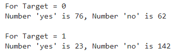

## Project Proposal
### Infographic

  

### Motivation & Background
Today, heart disease is the leading cause of death around the globe. In the United States alone, heart disease claims the life of one person every 36 seconds. Annually, it is responsible for the deaths of roughly 655,000 Americans which equates to 1 in every 4 deaths. To make matters worse, it costs our country about $219 billion per year due to healthcare service costs, medical costs, and lost productivity costs. Our group understands the impact this disease can have on so many individuals. Because of this, we decided to carry out our machine learning project on the prediction of heart disease.
#### Our Data Set
The data set we are using is a combination of data from four different health clinics around the globe, Cleveland Clinic Foundation, Hungarian Institute of Cardiology, V.A. Medical Center in Long Beach, CA, and University Hospital in Zurich, Switzerland. Each sample in the data set represents a person that was tested as a part of a heart disease study conducted by these facilities. The data set includes a discrete binary predictor of the current likelihood the patient has of having heart disease as well. We believe this predictor is based on how much specific blood vessels around each patient’s heart have narrowed.

### Data Cleaning
Ultimately, we have four datasets to work with: the pre-processed dataset from Kaggle with 14 features and 3 original, unprocessed data-sets with 75 features. The Kaggle data set did not give us much information detailing how they cleaned and processed the data. So, in order to explore the data sets and make the three original data-sets useable, we decided to process the data ourselves.

While there were originally 75 features, many of them were labelled by the uploader as "unusable" or simply had all, or mostly, null values. Null values were represented by "-9" in the data set. We used pandas to replace the -9 values with Nan for each of the datasets. We then removed individual data-points if they had more than 2/3 of their features as null, since we were unlikely to gain much information from such a data point. For points with far fewer null values, we tried estimating their values. For discrete values, we found the mode for that feature to use as a replacement value. For continuous values, we used the mean. In the supervised portion of the project, we might employ more advanced techniques to generate missing values, such as K-Nearest Neighbors. Additionally, our dataset had many non-binary categorical features. Because all of the unsupervised clustering algorithms that we will be running for this project are distance-based, we used scikitlearn to One-Hot-Encode those features, as we didn't want more weight given to the higher categorical values.

### Data Exploration and Scaling
With all of the data having been cleaned, we were ready to begin exploring the dataset. We began by looking at the number of datapoints with a target value of 0 versus 1, no heart disease versus heart disease. The results of this are plotted below, with slightly more patients having a target value of 1. We then created a correlation heat-map using Python's seaborn library. This visual would give us a good starting point in exploring the data, as it would tell us which features seem strongly correlated with heart disease. The values closest to 1 and -1 indicate strong positve and negative correlation respectively. Indicating a relationship between two variables. The last row or last column is our ground truth so variables with a strong relationship in that row should have a strong ability to predict heart disease.

  
   

Initially, there did not appear to be any extremely strong correlation of any particular feature with heart-disease. Out of all the continuous features, "thalach," which represents the maximum heart-rate achieved by the patient, seemed to be most strongly correlated with heart disease. Looking at the histogram below, we can see that plotting this feature gives a roughly normal distribution. However, it does appear to be skewed left. In order to help visualize the correlation, we also created a scatter plot, and separated the data points by the target value. Clearly, the higher the maximum heart rate achieved, the more likely the target value is to be 1 (heart-disease present).

  
   
  

We then created histograms and box plots for all continous features in the Kaggle pre-processed data-set, which are shown below. Most of the continuous features appear to be approximately normally distributed, which lead us to believe we should scale the data using sklearn's StandardScaler.

  
   
  
  

  
  
  

As for the discrete features, we decided to mainly use bar graphs to visualize the data. For the most important discrete features (features with most positive and most negative correlation relative to the target value), we created both an overall bar graph of all occurances and a bar graph separated by the target value (where 0 represents absence of heart disease and 1 represents presence of heart disease). These figures are displayed below.

  
  

  
  
  

  
  

  
  
  

### Methods
For the unsupervised portion of our project, we will use the k-means and DBSCAN algorithm to cluster our patients together under whether they have or do not have heart disease. We want to find the most important attributes that indicate the presence of heart disease for the patients in our data. For the supervised portion of our project, we plan to use a variety of machine learning techniques. In previous studies, the methods that have shown the most promise have been support vector machines (SVM), neural networks, decision trees, regression, and naive Bayes’ classifiers. We will be using classification for both of these. The UCI dataset we have been provided with has a goal attribute, which is a binary number of zero (< 50% narrowing of major vessels) to 1 (> 50% narrowing of major vessels). The goal for this model is to find trends within our data, and we hope these trends will allow us to find the groups most at risk of developing heart disease.

### Discussion

#### PCA
Getting into the unsupervised portion of this project, we decided to first run PCA on the scaled data-set to see if we would be able to reduce the dimentionality in any way. Our datasets have a high dimensionality and reducing this will allow us to increase the accuracy and recall of our models. However, after running PCA, it became apparent that it was unlikely that we could reduce our dimensionality by much. While the first principal component did contain a much larger percentage of the overall variance than any other component, the variance was not concentrated there, it contained only about 20% of the overall variance, shown in the graph below. At best, we would be able to reduce the dimentionality from 14 to 10 and would still only retain about 90% of the variance.

  

We still attempted plotting the first principal component against the second, and found what appeared to be a soft split of the target values, with values of 1 mostly on the left portion of the graph, and values of 0 mostly on the right portion of the graph. This lead us to believe that a form of soft SVM might yield good results in the supervised portion of this project. This visual also showed that our dataset would likely be able to form accurate clusters when running K-means. Overall, however, we did not gain too much insight from our data-set by running PCA. With that, we moved on the K-Means clustering.

  

#### K-Means Clustering
Next, we decided to run the K-means algorithm to try clustering the data. We conducted K-means on both the original dataset, and the dataset after going through PCA. The most important aspect of running this algorithm was to determine if our data contained clusters useful in classifying attributes or groups of attributes to specific outputs. The elbow method was used to determine the number of clusters for the K-means algorithm, which estimates the improvement for the addition of each cluster. Below are the graphs for the elbow method.

  
  

After creating the plot with the original dataset, there did not appear to be any clearly discernable elbow. It was plausible, however, that the elbow was in the range of 2 to 4 clusters. Therefore, we ran K-Means with 2, 3, and 4 clusters, and compared the results. The visualization scatter plots for 2 clusters, 4 clusters, and the PCA data are all shown below. The elbow in the PCA transformed dataset was clearer than the elbow found with the original dataset. Therefore, we decided to run k-means with only 2 cluster for the PCA transformed data set. Note that the values we used in K-means were scaled using StandardScaler, which is why the x-axis ranges from -3 to 3 for the "age" feature.

  
  
  
  

From the graph we see a semblance of a divide, but the differences between the clusters still isn't as clear as we would like it to be, however we think that this K-means classification can strengthen our supervised learning algorithms later down the line if we use the K-means classifiers as a feature.

  

Looking at the stats we see that each n-clusters performed relatively well. However, no clustering was dominate in all 3 metrics. Which we found surprising because we believed that as the number of clusters increases, we would see the model overgeneralize the dataset a bit more. Although 4 clusters performed the worst in 2/3 metrics, showing that increasing the clusters further would be detrimental to our models. Overall, the 2, 3, and PCA clusters performed the best. All being comparable in all 3 metrics with differences of about .01. The only exception to this being 3 clusters’s recall at about .95. We also decided to calculate the BetaCV measure for K-Means with 2 clusters. BetaCV is a measure of the intracluster to intercluster distance multiplied by the ratio of edges of of a cluster to edges into a cluser. A smaller betaCV indicates a better K-Means result. Ultimately, this value was calculated to be 1.644, which is relatively good considering the high dimentionality of our dataset (keep in mind how the curse of dimensionality can affect the Euclidian distances).

#### DBSCAN
We also ran DBSCAN to see if we could achieve results comparable to K-Means, or better. DBSCAN is a density based clustering algorithm, and so can detect abnormally shaped clusters. The purity in all of our runs for K-Means were around 0.80; which we thought might be partially due to non-circular (hyperspherical) clusters. The first step in performing this algorithm was to tune the parameters. First, we chose the min_pts parameter by simply doubling the number of total features, leaving us with a value of 28 for min_pts. Next, to find the value of epsilon, we used a form of K-Nearest-Neighbors with the Elbow Method, shown in the plot below.

  

Here, we use the Elbow Method to approximate a good value for espilon in DBSCAN. We find the distance of the closest neighbor to each point and order them from least to greatest. The center of the line graph represents the majority of the distances each point have to their neighbors. Using the area where the slope drastically increases on the right-hand side of the graph, or the elbow, will allow us to capture a good epsilon value that can ignore outliers. In this case, 4 is a good value for epsilon. After running DBSCAN with multiple values of epsilon around this range, we found the best results occured when epsilon was 4.26.  Once again, we graphed age vs thalach and separated by the target value, found below.. You can compare the results achieved by DBSCAN (left) to the ground-truth (right). 

  
  

DBSCAN achieved an overall purity of 0.7558, precision of 0.847, and recall of 0.6727. The purity of the clusters formed was relatively average compared to K-means in this scenario. However, a precision of 0.847 was the highest we have achieved with our unsupervised learning algorithms. This means there were very few false positives. While this is significant, recall is more important for us, as an incorrect prediction could prove to be deadly. Unforunately, the recall with DBSCAN was the worst out of all the unsupervised algorithms performed. This could possibly be due to different densities within an aparent cluster. Under these conditions, DBSCAN did not perform well. Thus, K-means seems to be the better unsupervised clustering algorithm to use when predicting heart disease.

### Results
Our measure of success on this project will be the final accuracy and recall. The final outcome of our project will be a program that predicts the likelihood that a person has heart disease. Therefore, recall will be an extremely important metric for us, as false negatives could prove to be deadly if not caught. Similarly, we aim to achieve high accuracy so that our results can be successfully applied to a large population. As a group, we have decided that our goal is to achieve a prediction accuracy and recall of greater than 60% to 65%, and a higher recall. Previous studies have reported approximately 75% accuracy and greater. Our overarching goal for this project is to identify the most important, contributing factors to heart disease for the patients in our dataset, and to then apply those findings in a model that can be used on a much larger scale.

### References
* Detrano R, Janosi A, Steinbrunn W, Pfisterer M, Schmid JJ, Sandhu S, Guppy KH, Lee S, Froelicher V. International application of a new probability algorithm for the diagnosis of coronary artery disease. Am J Cardiol. 1989 Aug 1;64(5):304-10. doi: 10.1016/0002-9149(89)90524-9. PMID: 2756873.
* https://www.cdc.gov/heartdisease/facts.htm
* https://www.sciencedirect.com/science/article/pii/S235291481830217X#:~:text=However%2C%20machine%20learning%20techniques%20can,
Regression%20and%20Na%C3%AFve%20Bayes%20classifiers.
* https://archive.ics.uci.edu/ml/datasets/heart+disease
* https://towardsdatascience.com/heart-disease-prediction-73468d630cfc
