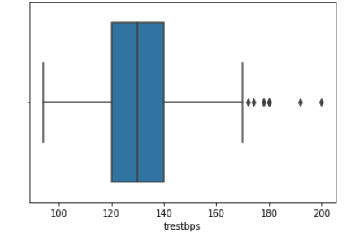

## Project Proposal
### Infographic

### Motivation & Background
Today, heart disease is a leading cause of death around the globe. In the United States alone, heart disease claims the life of one person every 36 seconds. Annually, it is responsible for the deaths of roughly 655,000 Americans which equates to 1 in every 4 deaths. To make matters worse, it costs our country about $219 billion per year due to healthcare service costs, medical costs, and lost productivity costs. Our group understands the impact this disease can have on so many individuals. Because of this, we decided to carry out our machine learning project on the prediction of heart disease.
#### Our Data Set
The data set we are using is a combination of data from four different health clinics around the globe, Cleveland Clinic Foundation, Hungarian Institute of Cardiology, V.A. Medical Center in Long Beach, CA, and University Hospital in Zurich, Switzerland. Each sample in the data set represents a person that was tested as a part of a heart disease study conducted by these facilities. The data set includes a discrete multiclass predictor of the current likelihood the patient has of having heart disease as well. We believe this predictor is based on how much specific blood vessels around each patient’s heart have narrowed.

### Data Cleaning
Ultimately, we have four datasets to work with: the pre-processed dataset from Kaggle with 14 features and 3 original, unprocessed data-sets with 75 features. The Kaggle data set did not give us much information detailing how they cleaned and processed the data. So, in order to explore the data sets and make the three original data-sets useable, we decided to process the data ourselves.

While there were originally 75 features, many of them were labelled by the uploader as "unusable" or simply had all, or mostly, null values. Null values were represented by "-9" in the data set. We used pandas to replace the -9 values with Nan for each of the datasets. We then removed individual data-points if they had more than 2/3 of their features as null, since we were unlikely to gain much information from such a data point. For points with far fewer null values, we tried estimating their values. For discrete values, we found the mode for that feature to use as a replacement value. For continuous values, we used the mean. In the supervised portion of the project, we might employ more advanced techniques to generate missing values, such as K-Nearest Neighbors. Additionally, our dataset had many non-binary categorical features. Because all of the unsupervised clustering algorithms that we will be running for this project are distance-based, we used scikitlearn to One-Hot-Encode those features, as we didn't want more weight given to the higher categorical values.

### Data Exploration and Scaling
With all of the data having been cleaned, we were ready to begin exploring the dataset. We began by looking at the number of datapoints with a target value of 0 versus 1, no heart disease versus heart disease. The results of this are plotted below, with slightly more patients having a target value of 1. We then created a correlation heat-map using Python's seaborn library. This visual would give us a good starting point in exploring the data, as it would tell us which features seem to be most strongly correlected with heart disease. The values closest to 1 and -1 in the last row and column of the table below are the parts to focus on.

Initially, there did not appear to be any extremely strong correlation of any particular feature with heart-disease. Out of all the continuous features, "thalach," which represents the maximum heart-rate achieved by the patient, seemed to be most strongly correlalated with heart disease. Looking at the histogram below, we can see that plotting this feature gives a roughly normal distribution, which appears to be slighly normal. However, it does appear to be skewed left. In order to help visualize the correlation, we also created a scatter plot, and separated the data points by the target value. Clearly, the higher the maximum heart rate achieved, the more likely the target value is to be 1 (heart-disease present).

We then created histograms and box plots for all continous features in the Kaggle pre-processed data-set, which are shown below. Most of the continuous features appear to be approximately normally distributed, which lead us to believe we should scale the data using sklearn's StandardScaler.

As for the discrete features, we decided to mainly use bar graphs to visualize the data. For most important continous feature (correlation close to 1 or -1), we created both an overall bar graph of all occurances and a bar graph separated by the target value (where 0 represents no heart disease is present and 1 represents heart disease is present). These figures are displayed below.

### Methods
For this project, we have found a data set with 75 attributes to train our models with. For the unsupervised portion of our project, we will use the k-means and DBSCAN algorithm to cluster our patients together under whether they have or do not have heart disease. We want to find the most important attributes that indicate the presence of heart disease for the patients in our data. For the supervised portion of our project, we plan to use a variety of machine learning techniques. In the past, the methods that have shown the most promise have been support vector machines (SVM), neural networks, decision trees, regression, and naive Bayes’ classifiers. We will be using classification for both of these. The UCI dataset we have been provided with has a goal attribute, which is a discrete number from zero (no presence) to 4 (almost certain presence). The goal for this model is to find trends within our data, and we hope these trends will allow us to find the groups most at risk of developing heart disease.

### PCA
Getting into the unsupervised portion of this project, we decided to first run PCA on the scaled data-set to see if we would be able to reduce the dimentionality of our data set in any way. However, after running PCA, it became apparent that this was not likely. While the first principal component did contain a much larger percentage of the overall variance than any of the other components, the variance was not concentrated in the first principal component, which contained only about 20% of the overall variance, shown in the graph below. At best, we would be able to reduce the dimentionality from 14 to 10 and still would only retain about 90% of the variance.

We still tried plotting the first principal component against the second, and found what appeared to be a soft split of the target values, with values of 1 mostly on the left portion of the graph, and values of 0 mostly on the right portion of the graph. This lead us to believe that a form of soft SVM might yield good results in the supervised portion of this project. This visual also showed that our dataset would likely be able to form accurate clusters when running K-means. Overall, however, we did not gain too much insight from our data-set by running PCA. With that, we moved on the K-Means clustering.

### K-Means Clustering
Next, we decided to run the K-means algorithm to try clustering the data. In order to chose the best number of clusters, we made use of the elbow method (finish explaining)

After creating the **scree**(?) plot, there did not appear to be any clearly discernable elbow. It was plausible, however, that the elbow was in the range of 2 to 4 clusters. Therefore, we ran K-Means with 2, 3, and 4 clusters, and compared the results. As far as cluster purity is concerned, 2 clusters did the best, with 3 clusters performing only a bit worse. 4 Clusters did the worst. The overall cluster purity for 2, 3, and 4 clusters was 0.8152, 0.8119, and 0.7657 respectively. A summary figure is included below (might be good to make these numbers a table)

Because the data-set includes the ground truth values, we were also able to calculate the precision, and recall for each of the 3 runs of K-means. Precision followed a similar trend to purity, with 2 clusters once again doing the best, 3 clusters doing slightly worse, and 4 clusters doing the worst. The precision was 0.7795, 0.7621, and 0.7176 respectively. However, the recall... 

We also ran K-Means on our PCA data. Our results showed that the PCA K-Means performed comparatively to the K-means on the original data set. The PCA trained K-Means also had the lowest recall among all K-Means algorthims. 
### Results & Discussion
Our measure of success on this project will be the final accuracy and recall. The final outcome of our project will be a program that predicts the likelihood that a person has heart disease. Therefore, recall will be an extremely important metric for us, as false negatives could prove to be deadly if not caught. Similarly, we aim to achieve high accuracy so that our results can be successfully applied to a large population. As a group, we have decided that our goal is to achieve a prediction accuracy and recall of greater than 60% to 65%, and a higher recall. Previous studies have reported approximately 75% accuracy and greater. Our overarching goal for this project is to identify the most important, contributing factors to heart disease for the patients in our dataset, and to then apply those findings in a model that can be used on a much larger scale.

### References
* Detrano R, Janosi A, Steinbrunn W, Pfisterer M, Schmid JJ, Sandhu S, Guppy KH, Lee S, Froelicher V. International application of a new probability algorithm for the diagnosis of coronary artery disease. Am J Cardiol. 1989 Aug 1;64(5):304-10. doi: 10.1016/0002-9149(89)90524-9. PMID: 2756873.
* https://www.cdc.gov/heartdisease/facts.htm
* https://www.sciencedirect.com/science/article/pii/S235291481830217X#:~:text=However%2C%20machine%20learning%20techniques%20can,
Regression%20and%20Na%C3%AFve%20Bayes%20classifiers.
* https://archive.ics.uci.edu/ml/datasets/heart+disease
* https://towardsdatascience.com/heart-disease-prediction-73468d630cfc
